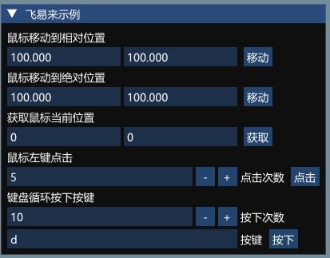

# 飞易来键鼠C导出库以及示例



## 项目说明
键鼠库完全使用C标准接口导出，支持大部分语言比如Python导入使用
本示例项目使用 CMake构建，需要自行先安装CMake

## 构建
```
git clone https://github.com/DarlingZeroX/feiyilai-example
cd feiyilai-example
cmake .\
```

## 快速开始
1.启动 feiyilaiExample 示例项目
2.相关示例代码都在example.cpp里面
3.具体接口库代码请查看msexport.h和msdk.h

## 错误解决
`如果运行出现由于找不到msdk.dll的错误，把feiyilaiDLL目录下的msdk.dll移动到程序输出文件夹即可`